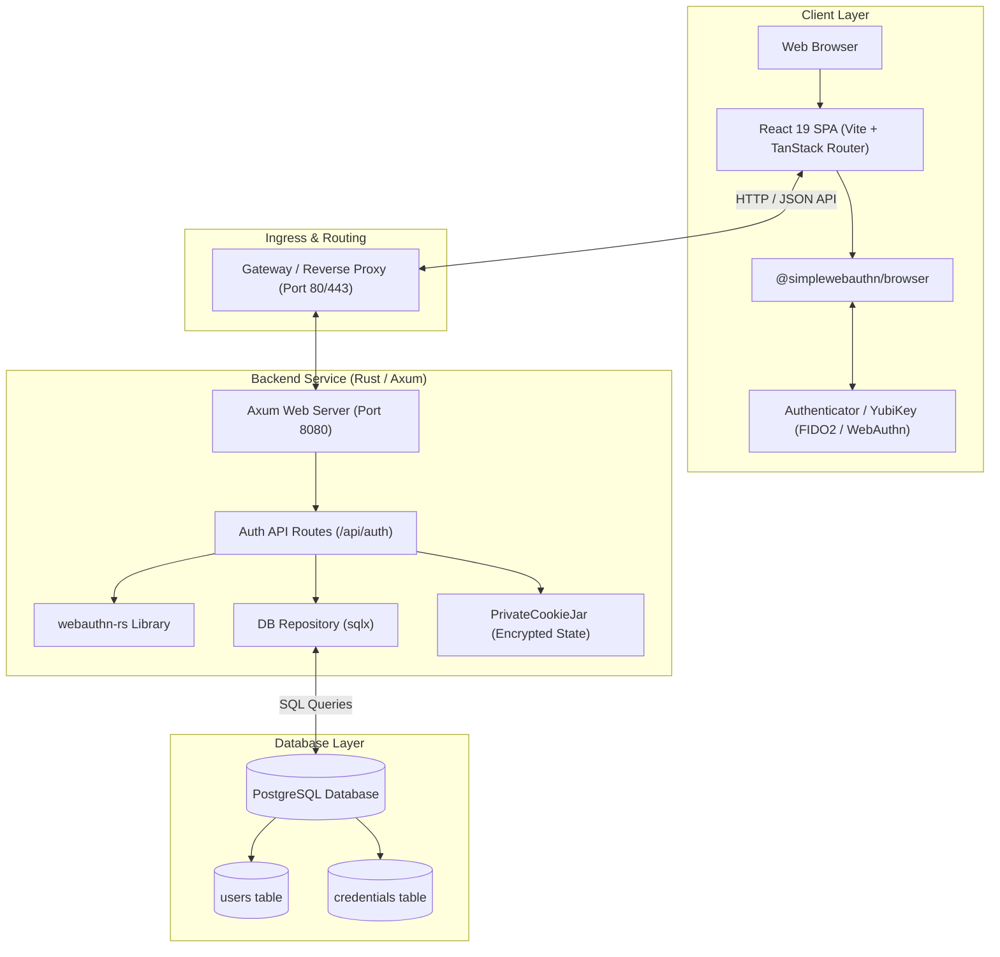
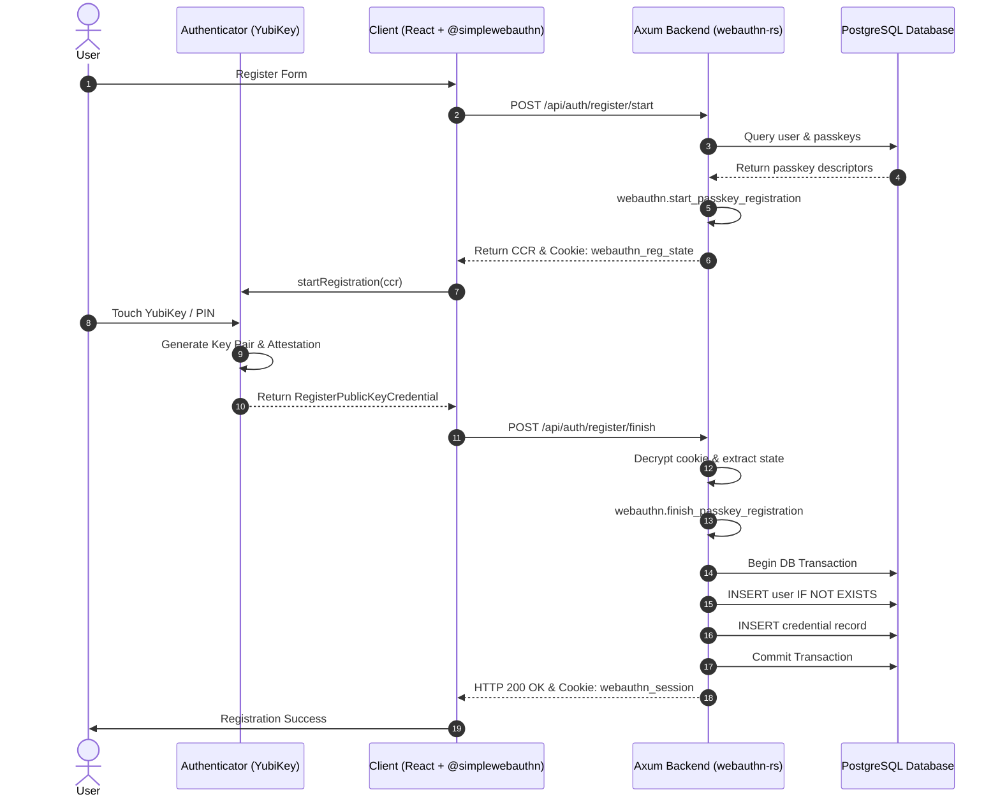
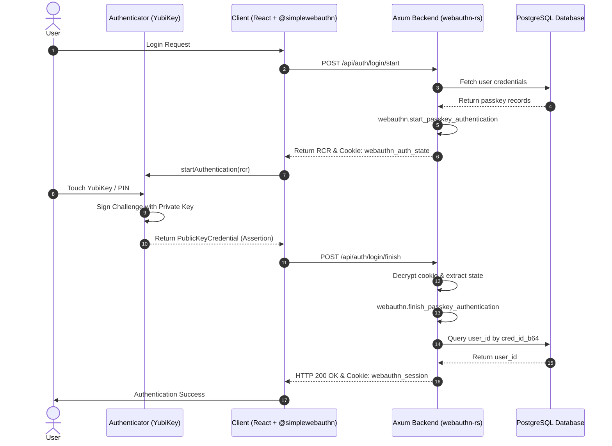

# YubiKey WebAuthn Demonstration Architecture & Documentation

This document describes the system architecture, WebAuthn
authentication/registration workflows, and exact data structures exchanged in
this project.

## Table of Contents

- [System Architecture](#system-architecture)
- [WebAuthn Flows & Data Exchange](#webauthn-flows--data-exchange)
  - [Passkey Registration Flow](#passkey-registration-flow)
  - [Registration Data Specifications & Schemas](#registration-data-specifications--schemas)
  - [Relationship Between CCR and Cookie State](#relationship-between-ccr-and-cookie-state)
  - [Detailed Breakdown of RegisterPublicKeyCredential](#detailed-breakdown-of-registerpublickeycredential)
  - [Passkey Authentication Flow](#passkey-authentication-flow)
  - [Authentication Data Specifications & Schemas](#authentication-data-specifications--schemas)
  - [Detailed Breakdown of PublicKeyCredential Assertion](#detailed-breakdown-of-publickeycredential-assertion)
- [Session Management & Endpoints](#session-management--endpoints)
- [Database Schema](#database-schema)
- [Cilium K8s Infrastructure & Gateway API](#cilium-k8s-infrastructure--gateway-api)
- [Local HTTPS & WebAuthn Setup (mkcert)](#local-https--webauthn-setup-mkcert)
- [Assets & Diagram Files](#assets--diagram-files)

---

## System Architecture

The project is structured as a full-stack WebAuthn/Passkey demonstration
application using a modern Rust backend, React frontend, and PostgreSQL
database.



### Component Breakdown

- **Frontend (`frontend/`)**: React 19 SPA powered by Vite, TanStack Router,
  `@tanstack/react-query`, and `@simplewebauthn/browser` for WebAuthn browser
  API integration.
- **Backend (`backend/`)**: Rust HTTP server built with Axum, `webauthn-rs`
  for WebAuthn RP logic, and `sqlx` for async PostgreSQL access.
- **Database (`migrations/`)**: PostgreSQL storing `users` and their WebAuthn
  `credentials`.
- **Deployment (`k8s/`, `scripts/`)**: Kubernetes manifests for frontend,
  backend, gateway, database, and database migration jobs.

---

## WebAuthn Flows & Data Exchange

### Passkey Registration Flow

The passkey registration process allows users to enroll a hardware security
key (e.g., YubiKey) or platform authenticator (e.g., Touch ID / Windows
Hello).

Raw Mermaid file: [docs/assets/registration_flow.mmd](assets/registration_flow.mmd)



### Registration Data Specifications & Schemas

#### 1. Registration Start Request (`POST /api/auth/register/start`)

- **Request Payload Schema (`RegisterStartRequest`)**:

  ```json
  {
    "username": "string (required, unique user handle)",
    "key_name": "string (optional, e.g. 'Work YubiKey 5C')"
  }
  ```

- **Concrete Request Example**:

  ```json
  {
    "username": "alice",
    "key_name": "Work YubiKey 5C"
  }
  ```

#### 2. Registration Start Response & State Cookie

- **Response Body Schema (`CreationChallengeResponse` / CCR)**:

  ```json
  {
    "publicKey": {
      "rp": {
        "name": "WebAuthn Demo",
        "id": "localhost"
      },
      "user": {
        "id": "550e8400-e29b-41d4-a716-446655440000",
        "name": "alice",
        "displayName": "alice (Work YubiKey 5C)"
      },
      "challenge": "base64url_string_32_random_bytes",
      "pubKeyCredParams": [
        { "type": "public-key", "alg": -7 },
        { "type": "public-key", "alg": -257 }
      ],
      "timeout": 60000,
      "excludeCredentials": [
        {
          "type": "public-key",
          "id": "base64url_existing_credential_id",
          "transports": ["usb", "nfc", "ble"]
        }
      ],
      "authenticatorSelection": {
        "userVerification": "preferred"
      },
      "attestation": "none",
      "extensions": {}
    }
  }
  ```

- **Encrypted Cookie Schema (`webauthn_reg_state` / `RegCookieState`)**:

  ```json
  {
    "username": "alice",
    "state": {
      "challenge": "base64url_string_32_random_bytes",
      "user": {
        "id": "550e8400-e29b-41d4-a716-446655440000",
        "name": "alice",
        "displayName": "alice (Work YubiKey 5C)"
      }
    }
  }
  ```

  *(Note: Encrypted in browser cookie jar via AES-GCM-256).*

### Relationship Between CCR and Cookie State

Yes, **`CreationChallengeResponse` (CCR)** and **`RegCookieState`
(`webauthn_reg_state`)** share overlapping fields (such as the `challenge`
bytes and user `id`/`name`), but they serve distinct architectural security
purposes:

1. **`CreationChallengeResponse` (Public Client Payload)**:
   - **Audience**: Sent in the HTTP response body to the Web Browser client.
   - **Purpose**: Passed directly into `navigator.credentials.create()`. It tells
     the authenticator (YubiKey) what challenge to sign, what cryptographic
     algorithms are supported, and which existing credentials to exclude.
2. **`RegCookieState` (Private Encrypted Server State)**:
   - **Audience**: Encrypted and saved in an HTTP-only browser cookie
     (`webauthn_reg_state`).
   - **Purpose**: Retains the expected challenge and user context on the server
     side without maintaining in-memory server session state. When the client
     submits `register/finish`, the server decrypts this cookie to verify that
     the returned attestation matches the exact challenge and user ID that the
     server originally issued.

#### 3. Registration Finish Request (`POST /api/auth/register/finish`)

- **Request Body Schema (`RegisterFinishPayload`)**:

  ```json
  {
    "id": "string (base64url credential ID)",
    "rawId": "string (base64url raw credential ID)",
    "type": "public-key",
    "response": {
      "clientDataJSON": "string (base64url encoded ClientDataJSON)",
      "attestationObject": "string (base64url encoded attestation CBOR)",
      "transports": ["string (optional: 'usb', 'nfc', 'ble', 'internal')"]
    },
    "clientExtensionResults": {},
    "name": "string (optional passkey label)"
  }
  ```

- **Concrete Request Example**:

  ```json
  {
    "id": "A1b2C3d4E5f6G7h8",
    "rawId": "A1b2C3d4E5f6G7h8",
    "type": "public-key",
    "response": {
      "clientDataJSON": "eyJ0eXBlIjoid2ViYXV0aG4uY3JlYXRlIi...==",
      "attestationObject": "o2NmbXRhbm9uZWdoYXR0U3RtdKJjc2ln..."
    },
    "name": "Work YubiKey 5C"
  }
  ```

### Detailed Breakdown of RegisterPublicKeyCredential

The `RegisterPublicKeyCredential` object (flattened inside
`RegisterFinishPayload`) represents the attestation response produced by the
authenticator:

1. **`id` (`String`)**:
   - Unique credential ID generated by YubiKey in URL-safe base64 encoding. Used
     as the primary key in the database `credentials` table.
2. **`rawId` (`String`)**:
   - Raw byte array of credential ID encoded in URL-safe base64 (matches `id`).
3. **`type` (`String`)**:
   - Constant string `"public-key"`, conforming to the W3C WebAuthn spec.
4. **`response` (`AuthenticatorAttestationResponse`)**:
   - **`clientDataJSON` (`String`)**:
     - Base64url-encoded JSON payload assembled by browser. Decodes to:

       ```json
       {
         "type": "webauthn.create",
         "challenge": "base64url_original_challenge",
         "origin": "http://localhost:3000",
         "crossOrigin": false
       }
       ```

     - Backend verifies that `type == "webauthn.create"`, `challenge` matches the
       issued challenge, and `origin` matches `RP_ORIGIN`.
   - **`attestationObject` (`String`)**:
     - Base64url-encoded CBOR binary object output directly by YubiKey hardware
       containing:
       - **Authenticator Data (`authData`)**:
         - RP ID SHA-256 Hash (32 bytes).
         - Flags Byte (User Presence `UP`, User Verification `UV`, Attested
           Credential Data `AT`).
         - Sign Counter (4 bytes 32-bit unsigned int).
         - Attested Credential Data: AAGUID (16 bytes), Credential ID Length (2
           bytes), Credential ID, and COSE Encoded Public Key (`alg`, `kty`,
           `crv`, `x`, `y`).
       - **Attestation Statement (`attStmt`)**: Cryptographic signature over
         `authData` + `clientDataHash` signed by the YubiKey attestation key.
       - **Format (`fmt`)**: Attestation format type (e.g. `"packed"`,
         `"fido-u2f"`, `"none"`).
   - **`transports` (`Option<Vec<String>>`)**:
     - Supported transport protocols reported by authenticator (e.g. `["usb"]`,
       `["nfc"]`, `["ble"]`, `["internal"]`).
5. **`clientExtensionResults` (`Object`)**:
   - Client extension evaluation results (e.g. PRF, credProps).

#### 4. Registration Finish Response

- **HTTP Status**: `200 OK`
- **Response Cookie (`webauthn_session`)**:
  - `webauthn_session=<encrypted_user_uuid>` (Max-Age: 86400, HttpOnly,
    SameSite=Lax).
  - `webauthn_reg_state=; Max-Age=0` (Cookie cleared).

---

### Passkey Authentication Flow

The authentication flow allows existing users to log in securely without
passwords using their registered WebAuthn credentials.

Raw Mermaid file: [docs/assets/authentication_flow.mmd](assets/authentication_flow.mmd)



### Authentication Data Specifications & Schemas

#### 1. Authentication Start Request (`POST /api/auth/login/start`)

- **Request Payload Schema (`LoginStartRequest`)**:

  ```json
  {
    "username": "string (optional, if empty performs discoverable passkey login)"
  }
  ```

- **Concrete Request Example**:

  ```json
  {
    "username": "alice"
  }
  ```

#### 2. Authentication Start Response & State Cookie

- **Response Body Schema (`RequestChallengeResponse` / RCR)**:

  ```json
  {
    "publicKey": {
      "challenge": "base64url_string_32_random_bytes",
      "timeout": 60000,
      "rpId": "localhost",
      "allowCredentials": [
        {
          "type": "public-key",
          "id": "base64url_registered_credential_id",
          "transports": ["usb", "nfc"]
        }
      ],
      "userVerification": "preferred",
      "extensions": {}
    }
  }
  ```

- **Encrypted Cookie Schema (`webauthn_auth_state` / `PasskeyAuthentication`)**:

  ```json
  {
    "challenge": "base64url_string_32_random_bytes",
    "allowed_credentials": [
      "base64url_credential_id_1",
      "base64url_credential_id_2"
    ]
  }
  ```

  *(Note: Encrypted in browser cookie jar via AES-GCM-256).*

#### 3. Authentication Finish Request (`POST /api/auth/login/finish`)

- **Request Body Schema (`PublicKeyCredential` Assertion)**:

  ```json
  {
    "id": "string (base64url credential ID)",
    "rawId": "string (base64url raw credential ID)",
    "type": "public-key",
    "response": {
      "clientDataJSON": "string (base64url encoded ClientDataJSON)",
      "authenticatorData": "string (base64url encoded authenticator bytes)",
      "signature": "string (base64url encoded ECDSA/RSA signature)",
      "userHandle": "string (optional base64url encoded user ID)"
    },
    "clientExtensionResults": {}
  }
  ```

- **Concrete Request Example**:

  ```json
  {
    "id": "A1b2C3d4E5f6G7h8",
    "rawId": "A1b2C3d4E5f6G7h8",
    "type": "public-key",
    "response": {
      "clientDataJSON": "eyJ0eXBlIjoid2ViYXV0aG4uZ2V0Ii...==",
      "authenticatorData": "SZYN5YgOjGh0NBcPZHZgW4_kp1...",
      "signature": "MEUCIQD3Z8Y9X2b4K1m9P...==",
      "userHandle": "VVVJRF9VU0VSX0lEX0JBNjQ="
    }
  }
  ```

### Detailed Breakdown of PublicKeyCredential Assertion

The `PublicKeyCredential` assertion payload submitted during `login/finish`
contains the cryptographic proof of identity signed by the YubiKey:

1. **`id` & `rawId` (`String`)**:
   - Base64url credential ID identifying which registered passkey was selected
     by the authenticator.
2. **`response` (`AuthenticatorAssertionResponse`)**:
   - **`clientDataJSON` (`String`)**:
     - Decodes to:

       ```json
       {
         "type": "webauthn.get",
         "challenge": "base64url_original_challenge",
         "origin": "http://localhost:3000",
         "crossOrigin": false
       }
       ```

     - Backend verifies `type == "webauthn.get"`, challenge match, and origin.
   - **`authenticatorData` (`String`)**:
     - Contains RP ID SHA-256 hash, UP/UV flags, and 32-bit sign counter.
   - **`signature` (`String`)**:
     - Base64url encoded ECDSA (P-256) or RSA signature over
       `authenticatorData` + `SHA-256(clientDataJSON)`. Backend verifies this
       signature using the public key stored during registration.
   - **`userHandle` (`Option<String>`)**:
     - Optional base64url encoded user UUID stored inside discoverable /
       resident passkeys.

#### 4. Authentication Finish Response

- **HTTP Status**: `200 OK`
- **Response Cookie (`webauthn_session`)**:
  - `webauthn_session=<encrypted_user_uuid>` (Max-Age: 86400, HttpOnly,
    SameSite=Lax).
  - `webauthn_auth_state=; Max-Age=0` (Cookie cleared).

---

## Session Management & Endpoints

All authenticated actions rely on the `webauthn_session` encrypted cookie.

### Endpoints Summary & Schemas

- **`GET /api/auth/me`**:
  - Requires: `webauthn_session` cookie.
  - **Response Schema (`UserProfileResponse`)**:

    ```json
    {
      "id": "550e8400-e29b-41d4-a716-446655440000",
      "username": "alice",
      "created_at": "2026-07-20T14:38:28Z",
      "credentials_count": 2
    }
    ```

- **`GET /api/auth/credentials`**:
  - Requires: `webauthn_session` cookie.
  - **Response Schema (`Vec<CredentialItem>`)**:

    ```json
    [
      {
        "cred_id": "A1b2C3d4E5f6G7h8",
        "name": "Work YubiKey 5C",
        "created_at": "2026-07-20T14:38:28Z"
      }
    ]
    ```

- **`PATCH /api/auth/credentials/{cred_id}`**:
  - **Request Body (`UpdateCredentialRequest`)**:

    ```json
    {
      "name": "Personal YubiKey Nano"
    }
    ```

  - Response: `HTTP 200 OK`.
- **`DELETE /api/auth/credentials/{cred_id}`**:
  - Deletes specified credential for the session user.
  - Response: `HTTP 200 OK`.
- **`POST /api/auth/logout`**:
  - Clears `webauthn_session` cookie.
  - Response: `HTTP 200 OK`.

---

## Database Schema

```sql
CREATE TABLE users (
    id UUID PRIMARY KEY,
    username VARCHAR(255) NOT NULL UNIQUE,
    created_at TIMESTAMPTZ NOT NULL DEFAULT NOW()
);

CREATE TABLE credentials (
    cred_id VARCHAR(255) PRIMARY KEY,
    user_id UUID NOT NULL REFERENCES users(id) ON DELETE CASCADE,
    passkey_json JSONB NOT NULL,
    name VARCHAR(255) NOT NULL DEFAULT 'Security Key',
    created_at TIMESTAMPTZ NOT NULL DEFAULT NOW()
);
```

---

## Infrastructure & Security Documentation

- **[Cilium K8s Infrastructure & Gateway API](cilium-k8s-infra.md)**: Details eBPF networking, Kube-Proxy Replacement, Gateway API controller, Envoy L7 proxy, LB-IPAM, and service topology.
- **[Local HTTPS & WebAuthn Setup with `mkcert`](mkcert-setup.md)**: Details WebAuthn Secure Context requirements (`window.isSecureContext`), trusted local root CA installation, certificate generation, and Kubernetes secret loading.

---

## Assets & Diagram Files

Raw Mermaid diagram files are available in `docs/assets/`:

- [docs/assets/architecture.mmd](assets/architecture.mmd)
- [docs/assets/registration_flow.mmd](assets/registration_flow.mmd)
- [docs/assets/authentication_flow.mmd](assets/authentication_flow.mmd)
